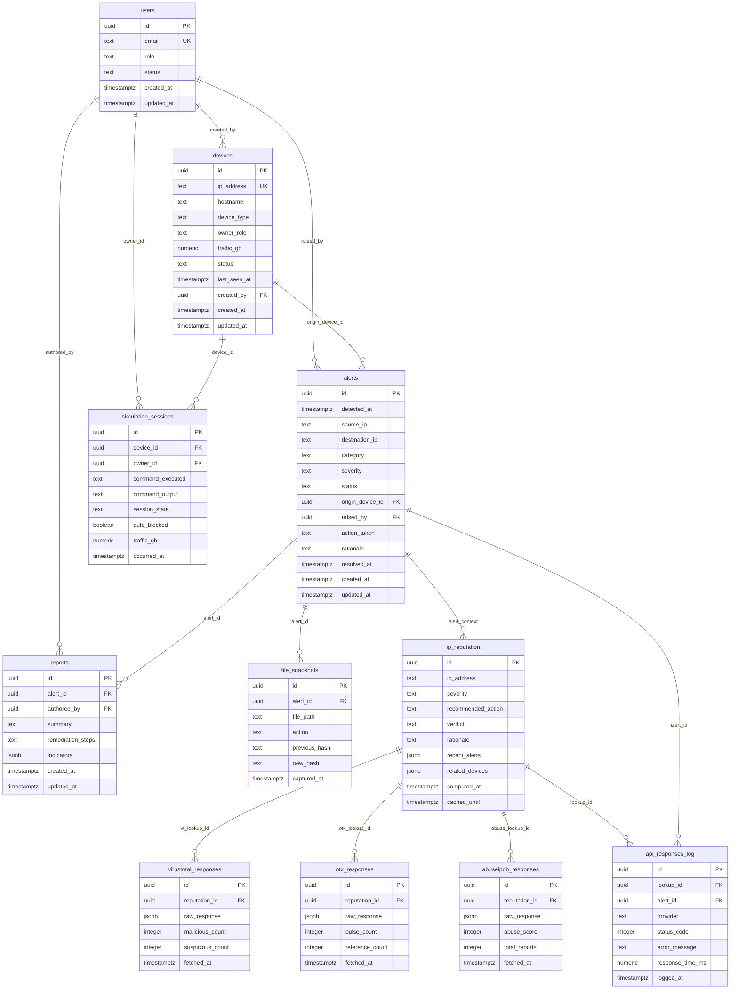

Software-only simulation / demo — no real systems will be contacted or modified.
# EyeGuard ERD

```mermaid
erDiagram
    users ||--o{ devices : "created_by"
    users ||--o{ alerts : "raised_by"
    users ||--o{ reports : "authored_by"
    users ||--o{ simulation_sessions : "owner_id"
    devices ||--o{ alerts : "origin_device_id"
    devices ||--o{ simulation_sessions : "device_id"
    alerts ||--o{ reports : "alert_id"
    alerts ||--o{ file_snapshots : "alert_id"
    alerts ||--o{ ip_reputation : "alert_context"
    ip_reputation ||--o{ virustotal_responses : "vt_lookup_id"
    ip_reputation ||--o{ otx_responses : "otx_lookup_id"
    ip_reputation ||--o{ abuseipdb_responses : "abuse_lookup_id"
    ip_reputation ||--o{ api_responses_log : "lookup_id"
    alerts ||--o{ api_responses_log : "alert_id"

    users {
        uuid id PK
        text email UK
        text role
        text status
        timestamptz created_at
        timestamptz updated_at
    }

    devices {
        uuid id PK
        text ip_address UK
        text hostname
        text device_type
        text owner_role
        numeric traffic_gb
        text status
        timestamptz last_seen_at
        uuid created_by FK
        timestamptz created_at
        timestamptz updated_at
    }

    alerts {
        uuid id PK
        timestamptz detected_at
        text source_ip
        text destination_ip
        text category
        text severity
        text status
        uuid origin_device_id FK
        uuid raised_by FK
        text action_taken
        text rationale
        timestamptz resolved_at
        timestamptz created_at
        timestamptz updated_at
    }

    reports {
        uuid id PK
        uuid alert_id FK
        uuid authored_by FK
        text summary
        text remediation_steps
        jsonb indicators
        timestamptz created_at
        timestamptz updated_at
    }

    simulation_sessions {
        uuid id PK
        uuid device_id FK
        uuid owner_id FK
        text command_executed
        text command_output
        text session_state
        boolean auto_blocked
        numeric traffic_gb
        timestamptz occurred_at
    }

    file_snapshots {
        uuid id PK
        uuid alert_id FK
        text file_path
        text action
        text previous_hash
        text new_hash
        timestamptz captured_at
    }

    virustotal_responses {
        uuid id PK
        uuid reputation_id FK
        jsonb raw_response
        integer malicious_count
        integer suspicious_count
        timestamptz fetched_at
    }

    otx_responses {
        uuid id PK
        uuid reputation_id FK
        jsonb raw_response
        integer pulse_count
        integer reference_count
        timestamptz fetched_at
    }

    abuseipdb_responses {
        uuid id PK
        uuid reputation_id FK
        jsonb raw_response
        integer abuse_score
        integer total_reports
        timestamptz fetched_at
    }

    ip_reputation {
        uuid id PK
        text ip_address
        text severity
        text recommended_action
        text verdict
        text rationale
        jsonb recent_alerts
        jsonb related_devices
        timestamptz computed_at
        timestamptz cached_until
    }

    api_responses_log {
        uuid id PK
        uuid lookup_id FK
        uuid alert_id FK
        text provider
        integer status_code
        text error_message
        numeric response_time_ms
        timestamptz logged_at
    }
```
